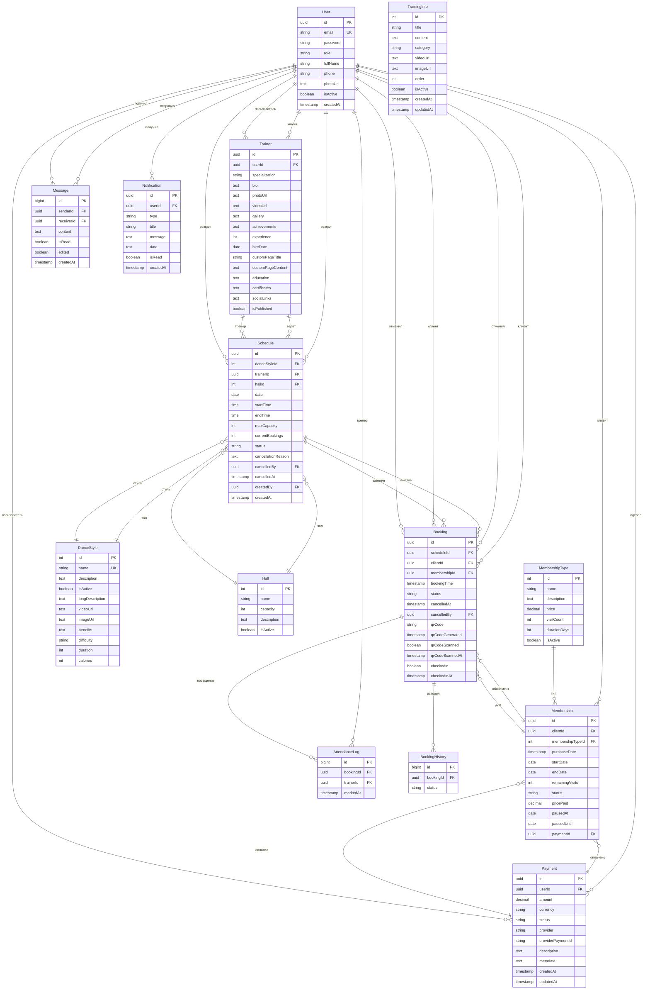

# Схема базы данных Dance Studio

## Визуальная схема (ER-диаграмма)



## Основные таблицы и их назначение

### 🧑‍💼 **User** - Пользователи системы
- **Роли**: `admin`, `trainer`, `client`
- **Связи**: Все основные сущности связаны с пользователями

### 👨‍🏫 **Trainer** - Тренеры
- Расширяет User дополнительной информацией
- Специализация, опыт, достижения, медиа-контент
- Публичная страница с кастомизацией

### 💃 **DanceStyle** - Стили танцев
- Название, описание, сложность
- Медиа-контент (видео, изображения)
- Преимущества, калории, длительность

### 🏠 **Hall** - Залы
- Вместимость, описание
- Связаны с расписанием

### 🎫 **MembershipType** - Типы абонементов
- Цена, количество визитов, длительность
- Неограниченные/ограниченные абонементы

### 💳 **Membership** - Абонементы клиентов
- Привязка к клиенту и типу абонемента
- Статус, оставшиеся визиты, даты паузы

### 📅 **Schedule** - Расписание занятий
- Тренер, стиль, зал, время, вместимость
- Статусы, отмена, создание

### 📝 **Booking** - Записи на занятия
- Клиент, занятие, абонемент
- QR-коды, посещаемость, история

### 📊 **AttendanceLog** - Журнал посещаемости
- Кто и когда отметил посещение

### 📜 **BookingHistory** - История изменений статусов записей

### 💬 **Message** - Сообщения чата
- Отправитель, получатель, контент
- Статус прочтения, редактирование

### 🔔 **Notification** - Уведомления
- Типы: отмена, напоминания и т.д.
- JSON с дополнительными данными

### 📚 **TrainingInfo** - Информация о подготовке
- Категории: подготовка, что взять, правила
- Медиа-контент

### 💰 **Payment** - Платежи
- Интеграция с платежными системами
- Статусы, метаданные

## Как посмотреть схему в pgAdmin

### 1. Подключение к базе данных

**Для локальной БД:**
```
Host: localhost
Port: 5432
Database: dance_studio
Username: postgres
Password: (из .env файла)
```

**Для Docker БД:**
```
Host: localhost
Port: 5432 (тот же порт пробрасывается)
Database: dance_studio
Username: postgres
Password: (из .env файла)
```

### 2. В pgAdmin:

1. **Откройте pgAdmin**
2. **Подключитесь к серверу** с указанными выше данными
3. **Разверните базу данных** `dance_studio`
4. **Перейдите в Schemas → public → Tables**
5. **Правый клик на таблице** → **Properties** для просмотра структуры
6. **Для просмотра связей**: вкладка **Constraints**

### 3. ER-диаграмма в pgAdmin:

1. **Выберите базу данных**
2. **Tools → ERD Tool** (или нажмите Ctrl+E)
3. **Выберите таблицы** для визуализации
4. **Получите интерактивную ER-диаграмму**

## Сравнение локальной и Docker БД

**Схемы идентичны** потому что:
- Обе используют один и тот же `schema.prisma` файл
- Prisma миграции применяются одинаково
- Docker просто пробрасывает порт 5432

**Различия могут быть в данных:**
- Локальная БД может содержать тестовые данные
- Docker БД может быть пустой при первом запуске
- Для синхронизации используйте `prisma db seed`

## Полезные команды

```bash
# Сгенерировать Prisma клиент
npx prisma generate

# Применить миграции
npx prisma migrate dev

# Посмотреть текущую схему
npx prisma db pull

# Заполнить БД тестовыми данными
npx prisma db seed

# Сбросить и пересоздать БД
npx prisma migrate reset
```

## Индексы для производительности

В схеме уже определены важные индексы:
- `messages`: [senderId, receiverId], [createdAt]
- `notifications`: [userId, isRead], [createdAt]

Они обеспечивают быструю загрузку чатов и уведомлений.
